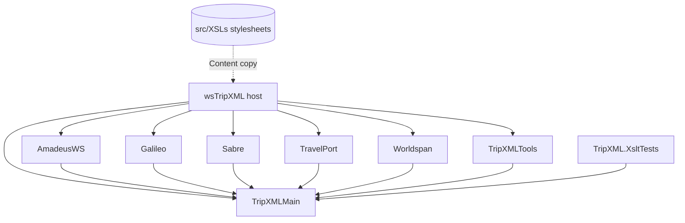

# TripXML Architecture

Living architecture reference for the TripXML monorepo after the .NET 10 / CoreWCF migration.
All file paths, symbols, and counts below were verified against the working tree at HEAD `e434fed`
(branch `docs/net10-migration-report`, 2026-06-12) with .NET SDK 10.0.300 on Windows 11.
Verification gates at that point: `dotnet build TripXML.slnx -c Release` = 0 errors, 839 warnings
(analyzer-level, e.g. CA2200 re-throw), 39.7 s; `dotnet test src/TripXMLMain/tests/TripXML.XsltTests -c Release`
= 24/24 passed in 2 s.

Companion documents: [migration-report.md](migration-report.md) (what changed and why),
[performance.md](performance.md) (measurement methodology), [development-guide.md](development-guide.md)
(how to build/run/regenerate), [adr/README.md](adr/README.md) (decision records),
[monorepo-consolidation-design.md](monorepo-consolidation-design.md) (how the repo was assembled),
[../MIGRATION_STATUS.md](../MIGRATION_STATUS.md) (pre-migration audit, historical).

## 1. System overview

TripXML is a SOAP middleware: travel agencies send OTA-shaped XML requests to one of 104 CoreWCF
endpoints; the host fans the request out to one or more GDS providers (Amadeus, Galileo/Apollo,
Sabre, Travelport, Worldspan), transforms each native response back to OTA via XSLT, optionally
aggregates multi-provider results, and returns a single SOAP response that is wire-compatible with
the retired ASMX service (see [adr/0001-corewcf-over-rest-rewrite.md](adr/0001-corewcf-over-rest-rewrite.md)).

### Project map

All projects target `net10.0` (verified in every csproj under `src/`).

| Project | Path | Owns |
|---|---|---|
| wsTripXML | src/wsTripXML/wsTripXML.csproj | Kestrel/CoreWCF host, 104 service implementations, generated contracts, routing/inspection behaviors, startup glue (`Microsoft.NET.Sdk.Web`) |
| TripXMLMain | src/TripXMLMain/TripXMLMain.csproj | Shared hub: `CoreLib` (XSLT engine, tracing, XSD validation), `modCore` (config bridge, shared structs/enums), `AppState`, `TtVbXsltFunctions`, `cDA` (SQL access) |
| AmadeusWS | src/Amadeus/AmadeusWS.csproj | Amadeus SOAP adapter (`AmadeusWSAdapter`, `ttHttpWebClient`, `BlackListClient`) |
| Galileo | src/Galileo/Galileo.csproj | Galileo/Apollo adapter (`GalileoAdapter`, hand-rolled `GalileoSoapClient`) |
| Sabre | src/Sabre/Sabre.csproj | Sabre adapter (`SabreAdapter` with ebXML headers and session pooling, `ttHttpWebClient`) |
| TravelPort | src/TravelPort/TravelPort.csproj | Travelport uAPI adapter (`ttHttpWebClient`) |
| Worldspan | src/Worldspan/Worldspan.csproj | Worldspan adapter (`WorldspanAdapter`, `ttHttpWebClient`) |
| TripXMLTools | src/TripXMLTools/TripXMLTools.csproj | Hasura-backed data loading (`TripXMLLoad`): users/providers, decoding tables, encode/decode lookups |
| TripXML.XsltTests | src/TripXMLMain/tests/TripXML.XsltTests/TripXML.XsltTests.csproj | XSLT regression tests (compile-all, golden transforms, `TtVbXsltFunctions` semantics) |
| XSLs | src/XSLs/ | Content-only: 553 `.xsl` stylesheets (no csproj; shipped by the host, see section 3) |

### Dependency graph

Verified from `ProjectReference` items in each csproj: every adapter and TripXMLTools reference
only TripXMLMain; the host references everything.

`TripXMLMain.AppState` lives in the hub precisely so GDS adapters can read decoding tables without
referencing the host (see [adr/0004-appstate-facade.md](adr/0004-appstate-facade.md)).

### Service inventory

- src/wsTripXML/Code/Generated contains 105 `.g.cs` files: 104 generated service contract files
  plus `ServiceRoutes.g.cs`. `ServiceRoutes.All` has exactly 104 entries (verified by counting
  `new(` lines).
- There are 103 `.asmx.cs` code-behind files under src/wsTripXML. Three services live in
  plain `.cs` files (src/wsTripXML/Code/wsStoredFareBuild.cs, src/wsTripXML/Code/wsStoredFareBuild_v03.cs,
  src/wsTripXML/Code/wsStoredFareUpdate.cs), and the class `wsCruiseCabinUnUnhold` is declared
  inside src/wsTripXML/Code/wsCruiseCabinUnhold.asmx.cs (sic — the double "Un" is the legacy name,
  preserved for wire parity).
- The root-level src/wsTripXML/wsAuthorization.asmx.cs (a 4-byte empty legacy code-behind) is
  excluded from compilation in src/wsTripXML/wsTripXML.csproj; the real `wsAuthorization`
  implementation lives in src/wsTripXML/Code/wsAuthorization.asmx.cs and is part of the 104.
- Two admin services live under src/wsTripXML/Code/Admin: `wsRefreshMem` (route
  `/Admin/wsrefreshmem.asmx`) and `wsImportLog` (route `/Admin/wsimportlog.asmx`), both part of the 104.

## 2. Request lifecycle

End-to-end path of a SOAP request, with file anchors.

### 2.1 Host bootstrap — src/wsTripXML/Program.cs

- `AddServiceModelServices()` + `AddServiceModelMetadata()` register CoreWCF; a singleton
  `UseRequestHeadersForMetadataAddressBehavior` makes WSDL addresses follow the request host header.
- DI registrations and lifetimes:
  - `AddHttpContextAccessor()` — backs `TripXMLRuntime.GetClientIpAddress()`.
  - `AddMemoryCache()` — the singleton `IMemoryCache` shared by `modMain` and `AppState`.
  - `AddScoped<modMain>()` — per-request pipeline helper (constructor-injected into the services
    that use the shared pipeline: 102 of the 104; `wsCreateTicketInvoice` and `wsUpdateMarkups`
    do not take it).
  - Two singleton `IServiceBehavior`s applied by CoreWCF to every service host:
    `SoapRequestInspectorBehavior` (fault logging, section 2.3) and `RequestElementRoutingBehavior`
    (body-element routing, section 2.2).
  - Every service implementation in `ServiceRoutes.All` is registered `AddTransient` —
    combined with `[ServiceBehavior(InstanceContextMode = InstanceContextMode.PerCall)]` on each
    generated class, this reproduces ASMX per-request instancing.
- `TripXMLRuntime.Initialize(app)` runs before endpoint mapping (section 4.2).
- Endpoint mapping loops over `ServiceRoutes.All`: per service, a `BasicHttpBinding` with
  `MaxReceivedMessageSize = 64_000_000`, `MaxBufferSize = 64_000_000`, and
  `Namespace` set to the contract's `ServiceContractAttribute.Namespace` (ASMX kept the WSDL
  binding in the service namespace; WCF would default to tempuri.org). An HTTPS Transport-mode
  twin endpoint is added only when the configured `urls` / `ASPNETCORE_URLS` contain "https".
  Fault detail is gated by the `IncludeExceptionDetailInFaults` config value (default false).
- `ServiceMetadataBehavior.HttpGetEnabled/HttpsGetEnabled = true` — every endpoint serves `?wsdl`.

### 2.2 Operation selection — src/wsTripXML/Code/Classes/RequestElementRouting.cs

ASMX services ran `SoapDocumentService(RoutingStyle = SoapServiceRoutingStyle.RequestElement)`:
the operation is chosen by the first SOAP body element, not by SOAPAction. The CoreWCF port:

- `RequestElementRoutingBehavior.ApplyDispatchBehavior` replaces each non-system
  `EndpointDispatcher.ContractFilter` with `new MatchAllMessageFilter()` — the default
  contract filter rejects empty/odd SOAPAction values before operation selection ever runs.
- `RequestElementOperationSelector.SelectOperation` buffers the message
  (`CreateBufferedCopy`), peeks `reader.LocalName` of the first body element, and returns it as
  the operation name (wrapped doc/literal: wrapper element name == operation name). Unknown
  names fall through to the standard CoreWCF dispatch fault.

Net effect: legacy clients that send an empty or arbitrary `SOAPAction` keep working.

### 2.3 Fault logging — src/wsTripXML/Code/Classes/cSoapRQ.cs

`cSoapRQ : IDispatchMessageInspector` is attached to every endpoint by
`SoapRequestInspectorBehavior` (the port of the ASMX `SoapExtension`):
`AfterReceiveRequest` buffers and captures the request envelope as correlation state;
`BeforeSendReply` checks `reply.IsFault`, extracts the fault reason via
`MessageFault.CreateFault`, and fire-and-forgets (`Task.Run`) persistence through
`cDA.AddSoapException`, falling back to `modMain.LogSoapExceptionToFile` on failure.

### 2.4 Generated adapter — src/wsTripXML/Code/Generated/wsAirAvail.g.cs (representative)

Each generated file declares (do not hand-edit; regenerate with tools/Generate-Contracts.ps1):

- `IwsAirAvail` with `[ServiceContract(Namespace = "http://tripxml.downtowntravel.com/tripxml/wsAirAvail", Name = "wsAirAvail")]`
  and `[XmlSerializerFormat(Style = OperationFormatStyle.Document, Use = OperationFormatUse.Literal)]`.
- Request/response `[MessageContract]` wrappers: `wsAirAvail_wmAirAvailRequest` with
  `WrapperName = "wmAirAvail"`, a `[MessageHeader] public TripXML TripXML` member, and the
  `OTA_AirAvailRQ` body member; `wsAirAvail_wmAirAvailResponse` with the body member named
  `wmAirAvailResult` (`{method}Result`, the ASMX convention).
- A `[ServiceBehavior(InstanceContextMode = InstanceContextMode.PerCall)]` partial class whose
  generated method copies `request.TripXML` into the code-behind field `tXML` and delegates to
  the legacy-shaped method `wmAirAvail(request.OTA_AirAvailRQ)`.

### 2.5 Service pipeline — src/wsTripXML/Code/wsAirAvail.asmx.cs (representative)

The partial code-behind `wsAirAvail(modMain modMain)` implements the actual flow in
`ServiceRequest(strRequest, ttServices.AirAvail)`:

1. `_modMain.PreServiceRequestPool(...)` (src/wsTripXML/Code/modMain.cs:219) — parses credentials
   from the request's `POS` node via `modMain.GetTravelTalkCredential`
   (src/wsTripXML/Code/modMain.cs:713; an unrelated static `TripXMLLoad.GetTravelTalkCredential`
   with a different signature exists in src/TripXMLTools/TripXMLLoad.cs:149 but is not on this
   path), logs the request to SQL via `cLog.LogRequest`
   (for high-volume service IDs 2, 6, 7, 24, 25, 81, 85 the request body is logged empty, and
   `LogResponse` skips those IDs entirely), optionally validates the
   request against XSD (`CoreLib.ValidateXML` when the `XSD{UserID}In` cache flag is set), and
   resolves `TripXMLProviderSystems` via `TripXMLTools.TripXMLLoad.GetProviderSystem`.
2. Per requested provider, the service spins a dedicated `Thread` over a provider class from
   src/wsTripXML/Code/Classes — `cServiceAmadeusWS`, `cServiceGalileo`, `cServiceSabre`
   (plus `cServiceTravelport` / `cServiceWorldspan` in services that support them) — wiring the
   `GotResponse` event to accumulate responses.
3. A poll loop waits until all providers responded or `modMain.CPrdTimeOut` (const `80`, seconds)
   elapses (src/wsTripXML/Code/modMain.cs:54).
4. Multi-provider responses are wrapped in `<SuperRS>` and merged by
   `cAggregation.Aggregate(ttServiceID, XslPath, "", ref strResponse)`
   (src/wsTripXML/Code/Classes/cAggregation.cs:14), which appends `Aggregation\` to the XSL path
   and runs the service-specific aggregation stylesheet.
5. `DecodeAirAvail` resolves airport/airline/equipment codes to names via
   `TripXMLLoad.DecodeValue` (src/TripXMLTools/TripXMLLoad.cs:481), which looks codes up in the
   cached `DecodingTables` object graph. The method also fetches the `ttAirports` / `ttAirlines` /
   `ttEquipments` `DataView`s from `TripXMLMain.AppState`
   (src/wsTripXML/Code/wsAirAvail.asmx.cs:42-44), but those locals are a legacy carry-over and
   never used — the DataViews' functional consumers are the Amadeus adapter's decode helpers
   (`GetDecodeValue`, src/Amadeus/TravelServices.cs:3459-3525).
6. `modMain.PostServiceRequest` (src/wsTripXML/Code/modMain.cs:319) re-validates against XSD when
   the `XSD{UserID}Out` flag is set.
7. `finally`: `_modMain.LogResponse` writes the response log row; `CoreLib.SendTrace` emits the
   OTA response trace when `modCore.Trace` is on.

### 2.6 Response serialization

The typed web method (`wmAirAvail`) deserializes the OTA XML string back into
`wmAirAvailOut.OTA_AirAvailRS` with `XmlSerializer`; CoreWCF then serializes the
`wsAirAvail_wmAirAvailResponse` wrapper, producing the ASMX-shaped
`<wmAirAvailResponse><wmAirAvailResult>...` body. Most services also expose `wm{X}Xml`
(raw string in/out) and some `wm{X}Json` (XML transformed to JSON via
`Newtonsoft.Json.JsonConvert.SerializeXmlNode`) operations.

## 3. XSLT engine

See [adr/0002-runtime-xslt-compilation.md](adr/0002-runtime-xslt-compilation.md) for why runtime
compilation replaced build-time `xsltc` assemblies.

### 3.1 CoreLib.TransformXML — src/TripXMLMain/CoreLib.cs:28

- Cache: `ConcurrentDictionary<string, XslCompiledTransform>` keyed by the **full stylesheet path**
  with `StringComparer.OrdinalIgnoreCase` (src/TripXMLMain/CoreLib.cs:25). Compilation happens once
  per process per stylesheet inside `GetOrAdd`.
- Load settings: `new XsltSettings(enableDocumentFunction: true, enableScript: false)` with an
  `XmlUrlResolver` — `xsl:import`/`document()` resolve relative to the stylesheet location;
  script blocks are dead (see 3.2).
- Every transform registers `TtVbXsltFunctions.Instance` under `urn:ttVB` via
  `XsltArgumentList.AddExtensionObject`.
- `CoreLib.ClearXslCache()` (src/TripXMLMain/CoreLib.cs:82) drops all compiled stylesheets so
  edited `.xsl` files are picked up; wired to the `/Admin/wsrefreshmem.asmx` endpoint (section 7).

Measured on the new stack only (no legacy-side baseline exists; in-process harness, JIT pre-warmed,
trivial non-matching `<root/>` input): first-call compile cost scales with stylesheet size —
`v03_Sabre_PNRReadRS.xsl` (254 KB) 78.28 ms, `Markups_LowFareRS.xsl` (31 KB) 16.29 ms,
`Aggregation_AirAvailRS.xsl` (2 KB) 2.28 ms; cached calls had medians of 0.016 / 0.006 / 0.003 ms
respectively. Caveat: the cached medians measure cache-hit overhead plus a transform over trivial
input that matches no templates — they are **not** realistic payload transform costs. The valid
headline: stylesheet compile cost (2–78 ms, scaling with size) is paid once per process per
stylesheet; the retired xsltc approach paid it at build time instead. Methodology in
[performance.md](performance.md).

### 3.2 Extension functions — src/TripXMLMain/TtVbXsltFunctions.cs

Replaces the `msxsl:script` VisualBasic blocks the legacy stylesheets carried. Commit `4cda4b7`
removed the script blocks from 27 stylesheets (28 files changed, +1/−351 — the 28th file is an
import-path fix in `Galileo_QueueRS.xsl`). XSLT binds extension functions by reflected method
name, case-sensitively; the public surface is exactly:

- `string FctDateDuration(string p_startDate, string p_endDate)`
- `DateTime FctArrDate(string p_startDate, double p_DateChange)`
- `string ShortDateFormat(string p_startDate)` — `"yyyy-MM-d"`, single `d`, matching legacy output
- `string GetBirthDate(string age)`
- `string datenow()` — lower-case on purpose; the stylesheets call `ttVB:datenow()`

Implementations call the same `Microsoft.VisualBasic` runtime overloads the compiled VB scripts
called, so conversion/formatting semantics are identical. Covered by
src/TripXMLMain/tests/TripXML.XsltTests (`TtVbXsltFunctionsTests.cs`, `XsltCompileAllTests.cs`,
`GoldenTransformTests.cs`; 24/24 green).

### 3.3 Stylesheet shipping and resolution

- src/XSLs holds 553 `.xsl` files across provider folders. The host ships nine of them —
  `Amadeus`, `AmadeusWS`, `Galileo`, `Sabre`, `Worldspan`, `Travelport`, `Aggregation`, `BL`,
  `TXML` — via a `Content` item in src/wsTripXML/wsTripXML.csproj with `LinkBase="Xsl"` and
  `CopyToOutputDirectory="PreserveNewest"`. The remaining folders (`Portal`, `PortalWS`,
  `PortalXML`, `SITA`, `TravelFusion`) are not consumed by this host.
- At runtime `modCore.XslPath` is set by `TripXMLRuntime.Initialize`
  (src/wsTripXML/Code/Classes/TripXMLRuntime.cs:50) to the `XslPath` setting, defaulting to
  `{TripXMLFolder|ContentRoot}\Xsl` — which is exactly where the Content items land in the
  output directory.

## 4. State and configuration

### 4.1 AppState — src/TripXMLMain/AppState.cs

Static facade over the host's `IMemoryCache` singleton, replacing `HttpApplicationState`.
Actual semantics, as implemented:

- `Initialize(IMemoryCache)` is called once by `TripXMLRuntime.Initialize`; before that, and for
  any missing key, `Get(key)` returns `null` and `Get<T>(key)` returns `default` — no exception.
- `Set` entries never expire (plain `_cache.Set`, no expiration options), matching Application
  semantics.
- It is the **same cache instance** `modMain` receives by constructor injection, so keys written
  through either API are visible to both.

Key cache entries and their writers/readers in this tree:

| Key | Written by | Read by |
|---|---|---|
| `ttAirports`, `ttAirlines`, `ttEquipments` (DataViews, columns `Code`/`Name`, sorted on `Code`) | `TripXMLLoad.BuildDecodingDataViews` (src/TripXMLTools/TripXMLLoad.cs:99) | Amadeus adapter decode helpers (`TravelServices.GetDecodeValue`, src/Amadeus/TravelServices.cs:3459-3525); service `Decode*` helpers (e.g. `wsAirAvail.DecodeAirAvail`) fetch them but never use them — see section 2.5 step 5 |
| `ttACL` (XmlDocument) | **no writer in this tree** | `modMain.PreServiceRequestPool` (src/wsTripXML/Code/modMain.cs:240) |
| `XSD{UserID}In` / `XSD{UserID}Out` (bool flags) | **no writer in this tree** | `modMain` / every service's `ServiceRequest` |
| `PS{Provider}{UserID}{System}{PCC}` (`TripXMLProviderSystems`) | **no writer in this tree** | provider branches in services (e.g. src/wsTripXML/Code/wsAirAvail.asmx.cs:133) |

Stated plainly: a grep across `src/` shows the only production `AppState.Set` call sites are the
three decode DataViews; the `ttACL`, `XSD{...}` and `PS{...}` entries are read but never populated
in the migrated codebase. Because `Get` returns null/default, the XSD flags silently evaluate to
false and the `PS{...}` unbox throws inside the per-provider `try/catch`, surfacing as a formatted
provider error. Effective provider resolution flows through `TripXMLLoad.GetProviderSystem` in
`PreServiceRequestPool` instead. This is a known migration-era gap, not a design feature — see
[migration-report.md](migration-report.md).

### 4.2 Configuration bridge — modCore.config and TripXMLRuntime

`modCore` (src/TripXMLMain/modCore.cs) exposes a `NameValueCollection config` property
(src/TripXMLMain/modCore.cs:25) that replaces `ConfigurationManager.AppSettings`
([adr/0005-modcore-config-bridge.md](adr/0005-modcore-config-bridge.md)).
`TripXMLRuntime.Initialize` (src/wsTripXML/Code/Classes/TripXMLRuntime.cs) is the Global.asax
replacement; in order it:

1. Pins `CultureInfo.DefaultThreadCurrentCulture/UICulture` to `en-US` — legacy servers ran en-US
   and the XSLT extension functions and VB conversions depend on it.
2. Copies the `AppSettings` section of `IConfiguration` into `modCore.config` — so environment
   variables (`AppSettings__HasuraEndpoint` etc.) override the committed placeholders.
3. Derives `modCore.XslPath`, `modCore.LogPath`, `modCore.SchemaPath` from `XslPath` /
   `TripXMLLogFolder` / `SchemaPath`, defaulting under `TripXMLFolder` or the content root.
4. Calls `AppState.Initialize(IMemoryCache)`.
5. Registers an `ApplicationStarted` background task that runs `modMain.TripXMLStartUp()`
   (TLS 1.2 pin, `TripXMLLoad.TripXMLLoadObject()`, `TripXMLLoad.GetDecodingTables()`) and
   `TripXMLLoad.BuildDecodingDataViews()`. Failures are logged and swallowed — the host must come
   up even when Hasura/SQL are unreachable, matching legacy `Application_Start` behavior.

src/wsTripXML/appsettings.json is **placeholders only** (enforced; real values come from
environment variables or an uncommitted `appsettings.Production.json`). Key names:
`TripXMLFolder`, `XslPath`, `SchemaPath`, `ConnectionString`, `BEConnectionString`, `Server`,
`Database`, `User`, `Password`, `TripXMLLogFolder`, `VCCApiBaseUrl`, `VCCUsername`, `VCCPassword`,
`ServerGuid`, `TraceServerUrl`, `HasuraEndpoint`, `HasuraKey`, `IsTravelportReprice`,
`IsTravelportWorldspan`, `AmadeusSkipCertValidation`.

### 4.3 Reference data — src/TripXMLTools/TripXMLLoad.cs

- `GetServerData` POSTs/GETs `{HasuraEndpoint}/tripxmlload` and `{HasuraEndpoint}/decoding` with
  the `x-hasura-admin-secret` header (`HasuraKey`).
- `TripXMLLoadObject` caches the per-server user/provider object graph (`UsersObject`, keyed by
  `ServerGuid`); `GetDecodingTables` caches `DecodingTables`. Both reload only on `isRefresh`.
- `GetProviderSystem` (src/TripXMLTools/TripXMLLoad.cs:175) materializes a
  `TripXMLProviderSystems` struct per request from `UsersObject` (PCC selection, SOAP2/SOAP4
  flags, profile fields, URLs).
- `UpdateCachedObjects` is the semaphore-guarded (`SemaphoreSlim(1,1)`) refresh used by
  `wsAdmin.UpdateCache()`.

## 5. GDS adapter pattern

See [adr/0003-handrolled-soap-clients.md](adr/0003-handrolled-soap-clients.md) for why generated
`SoapHttpClientProtocol` proxies were replaced by hand-rolled clients.

Shared shape across all five adapters: one `static`/`Lazy` `HttpClient` per process over
`SocketsHttpHandler` with `AutomaticDecompression` (gzip; gzip+deflate for Amadeus) and
`PooledConnectionLifetime = TimeSpan.FromMinutes(5)` (keeps DNS fresh), with per-request timeouts
preserving the legacy `HttpWebRequest.Timeout` values.

| Adapter | Client | Timeout (legacy parity) | Notable mechanics |
|---|---|---|---|
| Amadeus | src/Amadeus/ttHttpWebClient.cs | 90,000 ms via `HttpClient.Timeout` | `Lazy<HttpClient>` (defers creation until `modCore.config` is populated); SOAP2/SOAP4 envelope composers; gzip-compressed request bodies unless `ProxyURL` is set; `AmadeusSkipCertValidation` gate |
| Amadeus blacklist | src/Amadeus/BlackListClient.cs | default 100 s | hand-rolled `wsFlightBlackList` ASMX proxy (`wmFlightAdd`) |
| Galileo | src/Galileo/Classes/GalileoSoapClient.cs | per-call `CancellationTokenSource`; `GalileoAdapter` sets 60,000 ms for XmlSelect (src/Galileo/GalileoAdapter.cs:56), 100,000 ms default | hand-rolled SOAP 1.1; see below |
| Sabre | src/Sabre/ttHttpWebClient.cs | 60,000 ms per request via CTS | ebXML `MessageHeader` (src/Sabre/SabreAdapter.cs:75-86); session pooling against `tblSessionPool` when `ProviderSystems.SessionPool` (src/Sabre/SabreAdapter.cs:324+); reads fault bodies off non-2xx responses (replaces the legacy reflection hack on `WebException`) |
| Worldspan | src/Worldspan/ttHttpWebClient.cs | 180,000 ms per request via CTS (client `Timeout = InfiniteTimeSpan`) | plain SOAP envelope composer |
| Travelport | src/TravelPort/ttHttpWebClient.cs | no per-request timeout configured — `HttpClient` default 100 s applies | `soapenv` envelope with empty header |

Adapter-specific notes:

- **Amadeus certificate gate** (src/Amadeus/ttHttpWebClient.cs:67-71): the legacy adapter disabled
  TLS validation process-wide via `ServicePointManager`; the port scopes the bypass to the Amadeus
  handler. Semantics to know: when `AmadeusSkipCertValidation` is **null (unset) or "true"**,
  validation is bypassed — only an explicit `"false"` enables validation. Null-still-bypasses is
  deliberate legacy parity; flagged in [migration-report.md](migration-report.md).
- **Galileo byte-parity envelopes** (src/Galileo/Classes/GalileoSoapClient.cs): request envelopes
  are byte-identical to the retired .NET Framework 4.8 proxies (verified during migration against
  a loopback listener): UTF-8 **without BOM**, no indentation, namespace declarations in the order
  `soap`/`xsi`/`xsd`, members in declared order, null members omitted, empty strings as empty
  elements. SOAPAction prefix is `http://webservices.galileo.com/` for Production and
  `https://...` for the Copy system (the legacy proxies genuinely differed). SOAP faults surface
  as `GalileoSoapFaultException` whose `Message` carries the `faultstring` — `SoapException`
  parity at every call site. Only HTTP 200/400/500 are parsed as SOAP; anything else throws a
  protocol `WebException`, and per-call timeouts map to
  `WebException("The operation has timed out", ..., WebExceptionStatus.Timeout, ...)`.

## 6. Wire-parity invariants (MUST NOT break)

This section is the standing contract for any future change — human or agent. The migration's
core promise is that existing SOAP clients need zero changes. Each invariant below is encoded in
the generated contracts or routing code; breaking any of them breaks production clients.
Commit `bf710ba` (283 files, +6533 −8055) established these; its message also documents fixing
10 endpoints that 500 on legacy prod.

1. **`[XmlSerializerFormat(Style = Document, Use = Literal)]` on every service contract.**
   `DataContractSerializer` produces a different wire shape; never remove or replace it.
2. **`[MessageContract]` wrappers with `WrapperName` = the web-method name** (e.g. `wmAirAvail`)
   and `IsWrapped = true`. The wrapper element name doubles as the routing key (invariant 6).
3. **`TripXML` `[MessageHeader]` on request contracts.** The legacy `SoapHeader`
   (userName/password/compressed — class `TripXML`, declared at src/wsTripXML/Code/modMain.cs:2151)
   must remain a header member, in the contract namespace.
4. **Response body member named `{method}Result`** (e.g. `wmAirAvailResult`) inside a
   `{method}Response` wrapper — the ASMX naming clients deserialize against.
5. **Per-endpoint `BasicHttpBinding.Namespace` = contract namespace**
   (src/wsTripXML/Program.cs:49-56). Without it the WSDL `binding` lands in tempuri.org and
   strict consumers reject it.
6. **RequestElement routing stays.** `MatchAllMessageFilter` + `RequestElementOperationSelector`
   (src/wsTripXML/Code/Classes/RequestElementRouting.cs) must keep accepting empty/arbitrary
   SOAPAction and selecting the operation by first body element. Do not "fix" dispatch to be
   action-based.
7. **Contracts are generated artifacts.** Never hand-edit src/wsTripXML/Code/Generated/*.g.cs;
   change tools/Generate-Contracts.ps1 and regenerate
   (`pwsh tools/Generate-Contracts.ps1` — supports `-Only wsPing,wsAirAvail` for a subset).
8. **Galileo envelope byte-rules** (section 5): UTF-8 no BOM, no indentation, `soap`/`xsi`/`xsd`
   attribute order, declared member order, per-system SOAPAction scheme. The upstream gateway has
   historically been byte-sensitive; treat `BuildEnvelope` as frozen.
9. **en-US culture pinning before any XSLT/date formatting**
   (src/wsTripXML/Code/Classes/TripXMLRuntime.cs:34-35). `TtVbXsltFunctions` date parsing and VB
   conversions are culture-dependent; removing the pin changes transform output on non-en-US hosts.
10. **Extension-function names and signatures are frozen** (src/TripXMLMain/TtVbXsltFunctions.cs).
    XSLT binds them by reflected name, case-sensitively (`ttVB:datenow()` is lower-case on
    purpose); renames silently break stylesheets at runtime, not compile time.

Verification gate for changes in this area: build the slnx, run TripXML.XsltTests, then diff
`?wsdl` output and a captured SOAP round-trip for at least one affected endpoint against the
pre-change output (see [development-guide.md](development-guide.md)).

## 7. Hosting and operational characteristics

- **Server:** Kestrel (`Microsoft.NET.Sdk.Web`); HTTP always, HTTPS endpoints only when the
  configured URLs include an https address (src/wsTripXML/Program.cs:35-38). Message size caps:
  64 MB receive/buffer on every binding.
- **WSDL:** served per endpoint via `?wsdl`; metadata addresses follow request headers
  (`UseRequestHeadersForMetadataAddressBehavior`).
- **Startup:** measured cold start (new stack only, localhost loopback, Release, placeholder
  config; no legacy baseline) — process start to first HTTP 200 from `/wsPing.asmx?wsdl` with all
  104 CoreWCF endpoints registered: 1106 / 1113 / 1159 ms over 3 runs (25 ms poll granularity).
  Reference-data loading happens after `ApplicationStarted`, off the startup path, and tolerates
  unreachable Hasura/SQL (section 4.2).
- **Steady-state latency reference point** (same caveats; `wsPing` operation `ping` with
  `Delay=-1`, `Invoke-WebRequest` client): first call 158.43 ms (includes `XmlSerializer`
  first-use codegen), second call 11.39 ms, then median 2.02 ms / min 1.68 / max 4.01 over
  20 calls. Details and caveats in [performance.md](performance.md).
- **Cache refresh endpoints** (verified under src/wsTripXML/Code/Admin):
  - `/Admin/wsrefreshmem.asmx` — `wsRefreshMem.wmRefreshMem()` reruns `modMain.TripXMLStartUp()`,
    `TripXMLLoad.BuildDecodingDataViews()`, and `CoreLib.ClearXslCache()`; this is how edited
    stylesheets and refreshed Hasura data are picked up without a restart.
  - `/Admin/wsimportlog.asmx` — `wsImportLog`, log import service.
  - `/wsAdmin.asmx` — `wsAdmin` additionally exposes `UpdateCache()`
    (→ `TripXMLLoad.UpdateCachedObjects()`), `GetServerConfig()`, `GetServerVersion()`, and
    PNR/admin passthroughs (src/wsTripXML/Code/wsAdmin.asmx.cs).
- **Tracing:** `CoreLib.SendTrace` (src/TripXMLMain/CoreLib.cs:91) formats an XML trace fragment
  (tagged with the configured `ServerGuid`) and enqueues it on a `BlockingCollection<string>`
  capped at 50 pending items; a dedicated background thread pushes to WebSocket trace listeners —
  `ws://localhost:3070/Trace` plus the configured `TraceServerUrl` (src/TripXMLMain/CoreLib.cs:125).
  Tracing is fire-and-forget and must never block the request path. `modCore.Trace` is currently
  forced `true` in `TripXMLStartUp` (src/wsTripXML/Code/modMain.cs:2140, marked TODO pending
  TravelTalkUserSettings).
- **Request/response persistence:** `cLog` writes request/response rows to SQL via `cDA`
  (src/wsTripXML/Code/Classes/cLog.cs); SOAP faults are persisted by the `cSoapRQ` inspector
  (section 2.3).

## Decisions taken (pointers)

| Decision | Record |
|---|---|
| CoreWCF wire-parity port instead of a REST rewrite | [adr/0001-corewcf-over-rest-rewrite.md](adr/0001-corewcf-over-rest-rewrite.md) |
| Runtime XSLT compilation + process cache instead of xsltc | [adr/0002-runtime-xslt-compilation.md](adr/0002-runtime-xslt-compilation.md) |
| Hand-rolled SOAP clients instead of generated proxies | [adr/0003-handrolled-soap-clients.md](adr/0003-handrolled-soap-clients.md) |
| `AppState` static facade over `IMemoryCache` | [adr/0004-appstate-facade.md](adr/0004-appstate-facade.md) |
| `modCore.config` NameValueCollection bridge | [adr/0005-modcore-config-bridge.md](adr/0005-modcore-config-bridge.md) |
| Monorepo with imported history | [adr/0006-monorepo-with-history.md](adr/0006-monorepo-with-history.md) |
